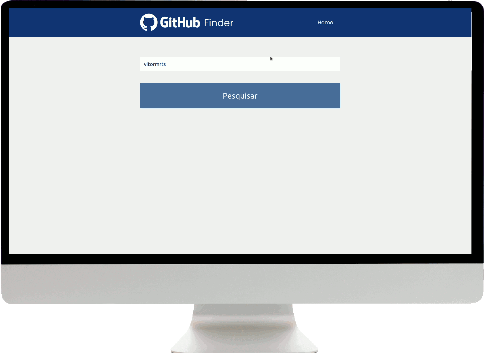

# GitHub Finder
> Project that uses the [GitHub REST API](https://docs.github.com/en/rest) to search for the desired user. 

Search for the desired user and find information about their profile and repositories.

<p align="center">
     
    
    
    
</p> 


## 🎥 Demo
This project was deployed in [Vercel](https://vercel.com). To see a demo, [click here](https://github-finder-vitormrts.vercel.app/). 

<div align="center">
     
</div>

## 🚀 Technologies
* ✔️ HTML
* ✔️ CSS 
* ✔️ JavaScript
* ✔️ GitHub REST API

## ℹ️ How To Use
### 1. Getting Started
To modify (locally) this project, you will need [Node](https://nodejs.org/pt-br/download/) and npm (it's comes installed with Node) or [Yarn](https://classic.yarnpkg.com/en/docs/install/#debian-stable) installed on your computer (Yarn was utilized in this project).

### 2. Creating a GitHub App
You will need to create a [GitHub App](https://docs.github.com/en/developers/apps/creating-a-github-app).

Now, go to [ENV.js](https://github.com/vitormrts/github-finder/blob/master/src/config/Env.js) file and fill the empty fields.

> PS: client_id and client_secret are presents in your GitHub App. If you don't generated a client secret, make this. 
### 3. Clonning And Running The Project

```sh
# Clone this repository
$ git clone https://github.com/vitormrts/github-finder

# Go to the repository cloned
$ cd github-finder

# Install npx
yarn add npx -g

# Run the app
npx http-server
```

Done! Now you can open this application.

<!-- CONTRIBUTING -->
## 🤝 Contributing

To contributing to this project, follow the steps bellow.

1. Fork the Project;
2. Create your Feature Branch (`git checkout -b new-branch`)
3. Commit your Changes (`git commit -m 'DESCRIPTION OF CHANGES'`)
4. Push to the Branch (`git push origin new-branch`)
5. Open a Pull Request

## 📝 License
This project is under the MIT license. See the [LICENSE](https://github.com/vitormrts/github-finder/blob/master/LICENSE) file for more details.

---

<p align="center">Made with ❤️ by <strong>Vitor Martins ✌ </p>
